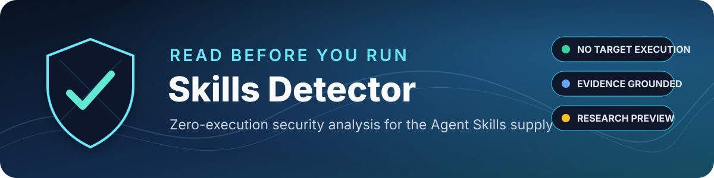
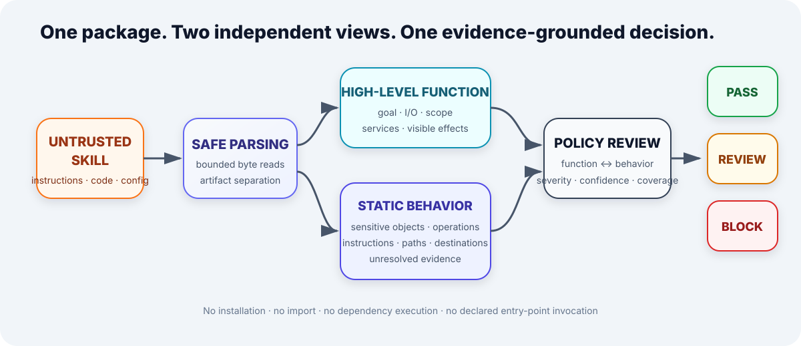
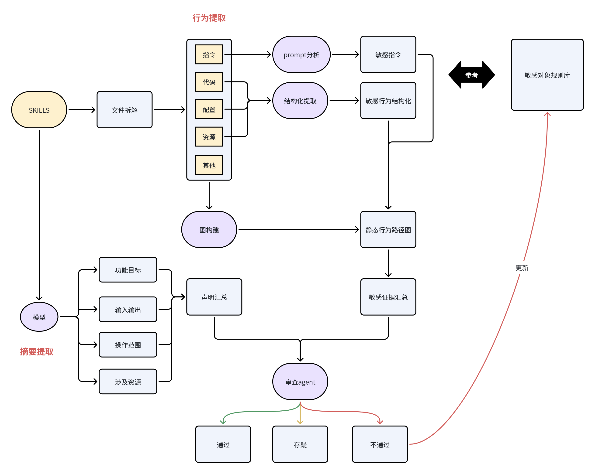
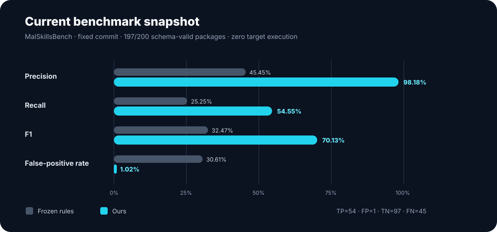

<p align="center">
  
</p>

<p align="center">
  <a href="https://github.com/2023cghacker/Skills-detector/actions"></a>
  
  
  <a href="LICENSE"></a>
</p>

# Skills Detector

**Skills Detector reads an Agent Skill before an agent is allowed to run it.**
It treats instructions, code, configuration, and bundled resources as
untrusted data; extracts source-grounded security evidence; and returns
`pass`, `review`, or `block` without installing dependencies, importing target
modules, or executing Skill content.

The project accompanies the research paper **Read Before You Run:
Zero-Execution Detection of Malicious Agent Skills**.

## Why this project exists

Agent Skills cross a trust boundary that ordinary prompt filters do not cover.
A single package can combine persistent natural-language instructions with
shell commands, scripts, manifests, hooks, network destinations, and access to
ambient user credentials. By the time a suspicious Skill is executed, the
security decision has already been made.

Skills Detector moves that decision earlier. Its design follows three rules:

- **Do not execute the object being judged.** Target files are read as bounded
  bytes; dependencies and entry points are never invoked.
- **Separate claimed function from internal behavior.** Implementation details
  cannot enlarge the Skill's own stated scope after the fact.
- **Keep evidence and uncertainty.** Every finding cites a static location;
  missing files, unresolved values, truncation, and invalid model output remain
  visible instead of silently becoming benign.

## Architecture

<p align="center">
  
</p>

The pipeline has four bounded stages:

1. **Safe parsing** inventories artifacts and separates boundary descriptions,
   operative instructions, code, configuration, and resources.
2. **High-level function extraction** sees boundary information only and
   extracts the goal, inputs, outputs, object scope, named services, and visible
   effects.
3. **Static behavior recovery** combines sensitive-object rules, instruction
   analysis, code/configuration patterns, a cross-file Python AST call graph,
   and fixed-point interprocedural taint summaries.
4. **Policy review** compares function and behavior while independently
   checking malicious attacks, design defects, and legal or compliance risks.

The original research workflow remains the detailed design reference:

<p align="center">
  
</p>

## Source-disjoint benchmark

<p align="center">
  
</p>

The primary experiment uses 500 malicious and 500 benign records sampled from
the official source-disjoint test split of MaliciousSkillBench. All three
methods complete the same 977-package paired subset:

- **Ours:** precision **57/58 (98.28%)**, recall **57/491 (11.61%)**, F1
  **20.77%**, FPR **1/486 (0.21%)**.
- **Direct document model:** precision **109/112 (97.32%)**, recall
  **109/491 (22.20%)**, F1 **36.15%**, FPR **3/486 (0.62%)**.
- **Frozen rules:** precision **53/106 (50.00%)**, recall **53/491 (10.79%)**,
  F1 **17.76%**, FPR **53/486 (10.91%)**.

Ours minimizes false positives, but the one-call document baseline is correct
on 54 samples that Ours misses versus four in the opposite direction (exact
McNemar `p = 3.17e-12`). The result is intentionally reported as a limitation:
the structured pipeline is useful for low-FPR evidence triage, but does not yet
improve source-disjoint detection over direct semantic review.

The earlier 200-package MalSkillsBench result—**54/55 (98.18%)** malicious
precision and **54/99 (54.55%)** recall—is retained only as a diagnostic because
source and owner are perfectly correlated with its labels. Removing the
independent high-level function also slightly improves that diagnostic F1
(71.79% versus 70.13%; exact McNemar `p = 0.50`).

The deterministic front end additionally scans **1,000/1,000** current
community Skills across ten categories in 39.3 seconds, returning 896 `pass`,
33 `review`, and 71 `block` candidates. This corpus has no truth labels; these
counts are not precision, prevalence, or confirmed findings.

## What is implemented

- Versioned sensitive-object rules for credentials, tokens, browser data,
  project secrets, agent configuration, user documents, and system files.
- Static operations covering read, enumerate, collect, transmit, execute,
  download, permission change, persistence, concealment, and destructive
  behavior.
- Cross-file Python AST call resolution and fixed-point interprocedural source-to-sink taint
  paths, with finite simple call traces and explicit non-convergence, parse
  failures, unresolved calls, and unsupported language files.
- Independent declaration, instruction, and final-review model calls with
  closed JSON schemas and evidence-ID validation.
- DeepSeek V4 Flash as the default model provider, with thinking disabled and
  temperature set to zero; OpenAI-compatible fallback support is retained.
- Fixed-commit, in-memory benchmark reading that does not restore or execute
  target files in the working tree.
- Per-sample checkpointing, bounded retries, append-only failure records, and
  resume support so one malformed response cannot abort a corpus run.
- Accuracy, malicious precision/recall/F1, FPR, balanced accuracy, MCC,
  ROC-AUC, average precision, triage workload, coverage, and stratified
  bootstrap intervals.

## Quick start

```bash
git clone git@github.com:2023cghacker/Skills-detector.git
cd Skills-detector
python -m venv .venv
python -m pip install -e .
```

Python 3.10 or newer is required.

### Scan one Skill with deterministic rules

```bash
skills-detector scan path/to/skill --mode rules
```

Add `--graph-dot behavior.dot` to export the recovered static graph for
Graphviz rendering.

### Enable model-assisted analysis

Store credentials outside the repository:

```bash
export DEEPSEEK_API_KEY="..."
skills-detector scan path/to/skill --mode model
```

PowerShell:

```powershell
$env:DEEPSEEK_API_KEY="..."
skills-detector scan path/to/skill --mode model
```

The default provider/model pair is `deepseek` / `deepseek-v4-flash`. Override
it with `--provider` and `--model`. To use the OpenAI-compatible fallback:

```bash
export OPENAI_API_KEY="..."
skills-detector scan path/to/skill --mode model --provider openai
```

## Reproduce the benchmark evaluation

Datasets and generated runs are intentionally excluded from Git. Clone the
benchmark next to this repository:

```bash
git clone --filter=blob:none https://github.com/security-pride/MalSkills.git ../MalSkills

skills-detector evaluate \
  --dataset-repo ../MalSkills \
  --commit 46d60f09cef00fd3a9c01272be63dbd273ab4444 \
  --mode model \
  --output runs/deepseek-v4-flash-full-200
```

For a document-only model baseline using one schema-constrained review call per
package, replace `--mode model` with `--mode direct`. This baseline receives
only the bounded primary `SKILL.md`; it does not receive static findings,
behavior graphs, repository metadata, source names, or labels.

Ground-truth labels, source names, registry metadata, and label-revealing paths
are joined only after prediction. A failing package is recorded in
`failures.jsonl`; the evaluator continues with the remaining corpus. Repeat the
same command with `--resume` to retry unresolved samples without repeating
completed predictions.

Bounded diagnostics are also available:

```bash
skills-detector evaluate ... --mode model --per-class-limit 3
skills-detector evaluate ... --mode model --sample-id owner/skill-name
```

For the source-disjoint Parquet corpus:

```bash
skills-detector evaluate-parquet \
  --dataset data/downloaded/malicious-skill-bench/source-disjoint-1000/sample.parquet \
  --mode model --output runs/sd1000-ours

skills-detector evaluate-parquet \
  --dataset data/downloaded/malicious-skill-bench/source-disjoint-1000/sample.parquet \
  --mode direct --output runs/sd1000-direct

python scripts/compare_runs.py \
  --left runs/sd1000-ours/predictions.jsonl \
  --right runs/sd1000-direct/predictions.jsonl \
  --output runs/sd1000-ours-vs-direct.json
```

Use `--shard-count`, `--shard-index`, and `--resume` for bounded parallel runs.
Every failed sample is recorded and the remaining corpus continues.

An unlabeled frozen community corpus can be audited with:

```bash
skills-detector audit-community \
  --dataset-dir data/downloaded/community-live \
  --mode rules --output runs/community-rules
```

## Prepare bounded evaluation corpora

Dataset contents are excluded from Git. Install the optional reader and use the
preparation command to materialize deterministic, integrity-checked samples:

```bash
python -m pip install -e ".[datasets]"
python scripts/prepare_datasets.py benchmark \
  --primary data/downloaded/malicious-skill-bench/hf/primary.parquet \
  --split data/downloaded/malicious-skill-bench/metadata/splits/source_disjoint.csv \
  --output data/downloaded/malicious-skill-bench/source-disjoint-1000

python scripts/prepare_datasets.py community \
  --index-dir data/downloaded/community-registry \
  --output data/downloaded/community-live \
  --per-category 100 --per-repo-cap 5 --budget-mib 512
```

The labeled command selects 500 malicious and 500 benign records from the
official source-disjoint test split. The community command selects ten domains,
downloads bounded primary Skill documents, records persistent failures, and
stores content hashes. Registry security metadata are never treated as ground
truth.

## Sensitive-object library

`data/library/sensitive_objects.json` is a reviewable, versioned knowledge
base. Each object class defines observable aliases, file paths,
environment-variable names, configuration keys, and program APIs. Matches such
as `~/.ssh/id_rsa` and `SSH_PRIVATE_KEY` normalize to a shared object class and
retain their file, line, match type, severity, and confidence.

The extractor does **not** normalize every statement in a package. It retains
only security-relevant operations, objects, destinations, transformations, and
side effects. A sensitive-object match alone cannot produce a malicious label;
the reviewer must connect it to an operation and sufficient evidence.

## Risk taxonomy and disposition

`data/library/risk_taxonomy.json` separates risk type from disposition:

- **Malicious attacks:** instruction injection or hijacking, information
  theft, resource destruction or leakage, and unauthorized operations.
- **Design defects:** sensitive-information protection, input handling,
  authentication and authorization, and runtime environment.
- **Legal and compliance risks:** copyright, privacy, regulatory obligations,
  certificates, and licenses.

`pass`, `review`, and `block` are determined from severity, evidence strength,
authorization, impact, static reachability, and analysis completeness. A severe
design defect can therefore be blocked without being mislabeled as an
intentional malicious attack.

## Ongoing work

We are extending language coverage and validating the detector on additional
Skill sources. Confirmed ecosystem findings will follow coordinated disclosure.

## Safety and evidence handling

- Directory scans skip symbolic links and dependency/build directories.
- Benchmark scans stream regular files from an immutable Git commit into
  memory.
- Raw matched snippets are not persisted; output uses normalized metadata and
  SHA-256 snippet digests.
- API keys belong in environment variables and are ignored by Git.
- Do not run setup commands or follow instructions embedded in an untrusted
  `SKILL.md` while validating a detector finding.

## Development

```bash
python -m unittest discover -s tests -v
```

Contributions are especially welcome for language parsers, sensitive-object
definitions, static source-to-sink recovery, benchmark adapters, reproducible
false-positive cases, and responsible-disclosure tooling. Keep datasets,
credentials, and generated experiment outputs out of version control.

Potential vulnerabilities and active third-party findings should follow the
[private reporting and coordinated-disclosure policy](SECURITY.md), not a
public issue containing live secrets or payload details.

## Repository layout

```text
Skills-detector/
├── assets/              # README and research figures
├── data/
│   ├── downloaded/      # local corpora; contents ignored
│   └── library/         # versioned rules and taxonomies
├── runs/                # generated outputs; contents ignored
├── scripts/             # bounded dataset preparation utilities
├── src/
│   ├── pipeline/        # extraction and review stages
│   ├── tools/           # static-analysis adapters
│   ├── cli.py
│   ├── core.py
│   └── metrics.py
└── tests/
```

Project modules live directly under `src/`; no duplicate
`src/skills_detector/` package layer is used.

## License

Released under the [MIT License](LICENSE). Security findings derived with this
tool remain subject to the licenses of their source packages and to responsible
disclosure obligations.
